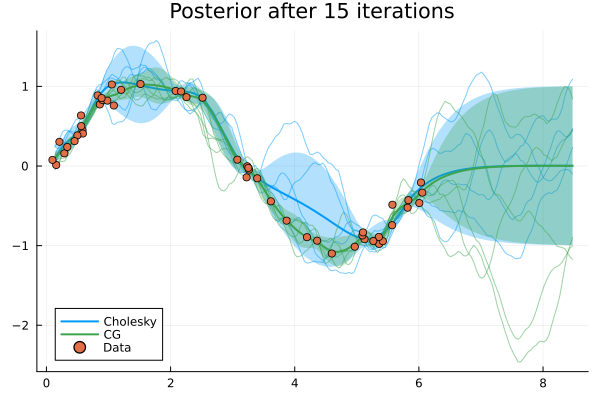

# IterGPs

A Julia implementation of [Posterior and Computational Uncertainty
in Gaussian Processes](https://arxiv.org/pdf/2205.15449.pdf).

[](https://github.com/SebastianCallh/IterGP.jl/actions/workflows/CI.yml?query=branch%3Amain)


## Usage

IterGPs uses the [AbstractGPs](https://github.com/JuliaGaussianProcesses/AbstractGPs.jl) interface.


```julia
using Random
using Plots
using KernelFunctions
using AbstractGPs
using IterGPs


# Generate some toy data
n = 50
σ = 0.1
rng = Xoshiro(1234)
noise = randn(rng, n).*σ
x = rand(rng, n) .*6 .+ 0.1.*randn(rng)
y = sin.(x) .+ noise

# Set up a vanilla AbstractGPs.GP
xx = collect(1.4 .* range(extrema(x)..., 200))
k = Matern32Kernel()
f = GP(k)
fx = f(x, σ^2)

# Cholesky actions
maxiters = 15
chol_pf = posterior(fx, y, CholeskyPolicy(length(x), maxiters))

# Conjugate gradient actions
maxiters = 15
x0 = zeros(length(x))
cg_pf = posterior(fx, y, ConjugateGradientPolicy(x0, maxiters))

plt = plot(xx, chol_pf, label="Cholesky", title="Posterior after $maxiters iterations", color=1)
plot!(plt, xx, rand(rng, chol_pf(xx), 5), color=1, label=nothing, alpha=0.5)
plot!(plt, xx, cg_pf, label="CG", title="Posterior after $maxiters iterations", color=3)
plot!(plt, xx, rand(rng, cg_pf(xx), 5), color=3, label=nothing, alpha=0.5)
scatter!(plt, x, y, label="Data", color=2)
```



# Implementation details
The IterGP API builds around `AbstractGPs.GP`, and exposes policies which can be used to call `IterGPs.posterior`, which is where the magic happens.

As a way to cache computations (such as preconditioners), the policy object itself is not called in the innermost loop. Instead, the policy is used to create an /actor/ which is then called in the inner loop until a convergence criteria is met.

# References
Apart from the actual paper, these lecture notes ([Scaling GPs](https://media.githubusercontent.com/media/philipphennig/NumericsOfML/main/slides/03_ScalingGPs.pdf)), ([Computation aware GPs](
https://media.githubusercontent.com/media/philipphennig/NumericsOfML/main/slides/04_ComputationAwareGPs.pdf)) explain a lot of the implementation.
